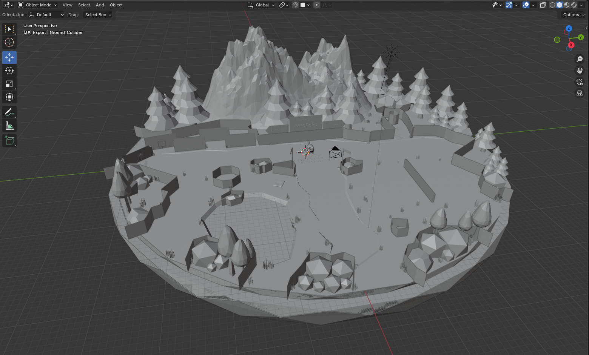
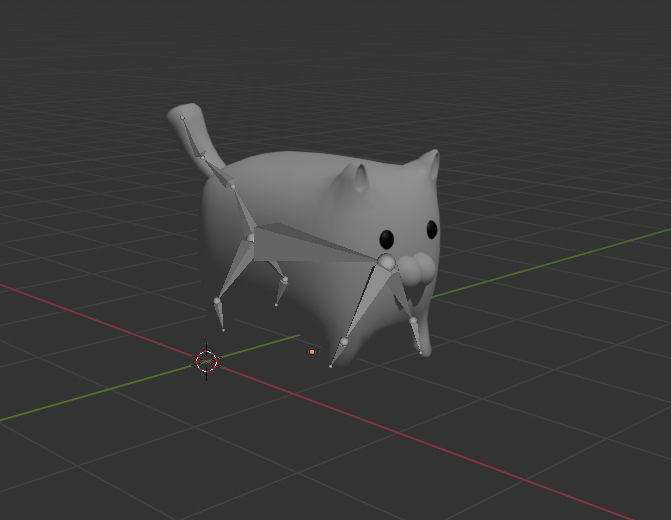

# Personal 3D Interactive Portfolio Website Project (VitoFolio)

A project that started from a hobby of learning how to create custom models for my 3D printer on Blender, inspired me to create an interactive **3D portfolio** built with **React**, **TypeScript**, **Vite**, **Three.js**, and custom models from **Blender**. Explore a low-poly island, move a character with WASD / arrow keys, and click hotspots to read about projects, work history, educataion, and interests.

## Tech stack

- React 19 · TypeScript · Vite  
- Three.js (scene, GLTF, raycasting, octree collision)  
- Blender (environment & character/animation)

## Preview

<p align="center">
  
  
  
</p>

## Development

```bash
npm install
npm run dev
```

```bash
npm run build
npm run preview
```
