# VitoFolio

Interactive **3D portfolio** built with **React**, **TypeScript**, **Vite**, **Three.js**, and **Blender**. Explore a low-poly island, move a character with WASD / arrow keys, and click hotspots to read about projects, work history, and interests.

## Tech stack

- React 19 · TypeScript · Vite  
- Three.js (scene, GLTF, raycasting, octree collision)  
- Blender (environment & character)

## VitoFolio — site screenshots

<p align="center">
  
  
  
</p>

## More project previews

Screenshots from other work featured in the experience:

### Real Estate CRM dashboard (ML lead generation)

<p align="center">
  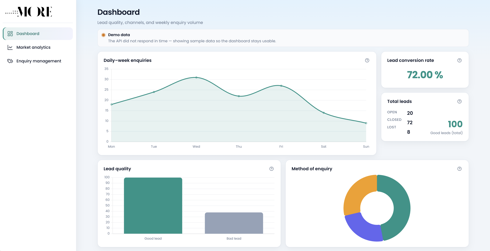
  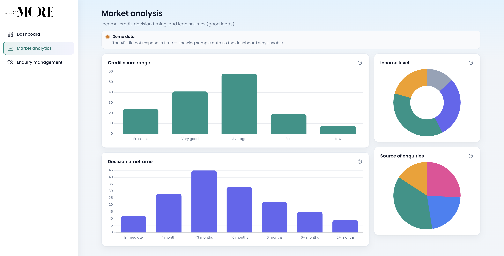
  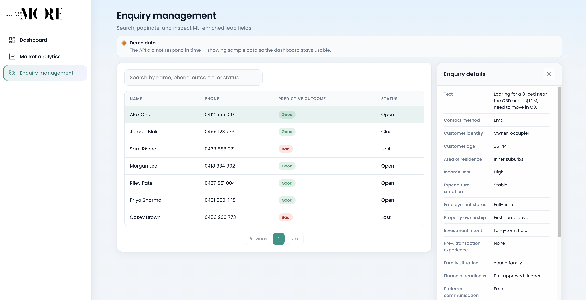
</p>

### BirdFeed — social ranking (Flutter)

<p align="center">
  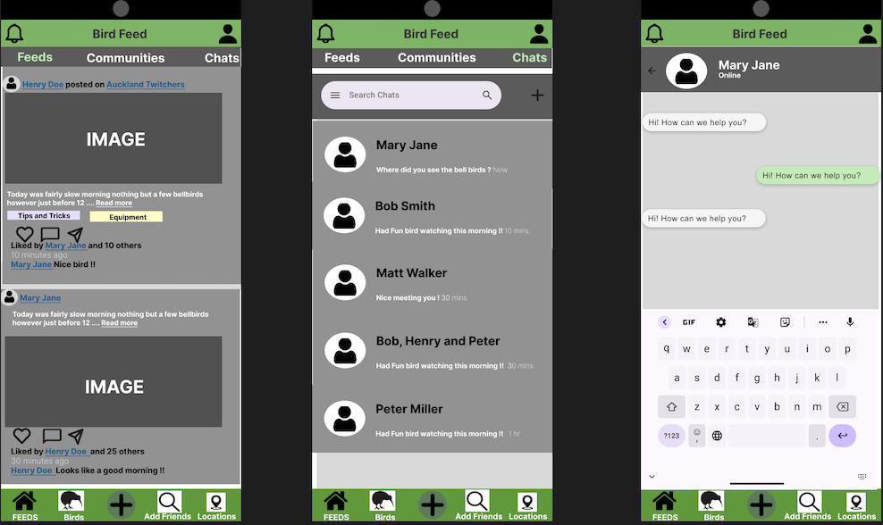
  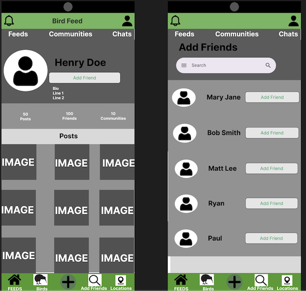
</p>

### Hospital delivery robots — NNFL project

<p align="center">
  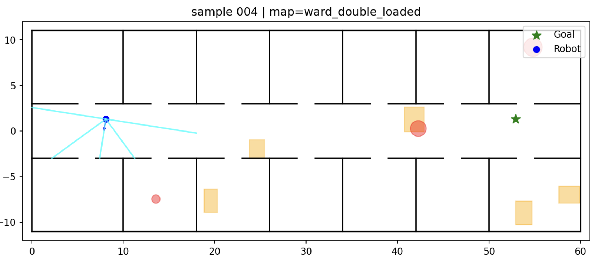
  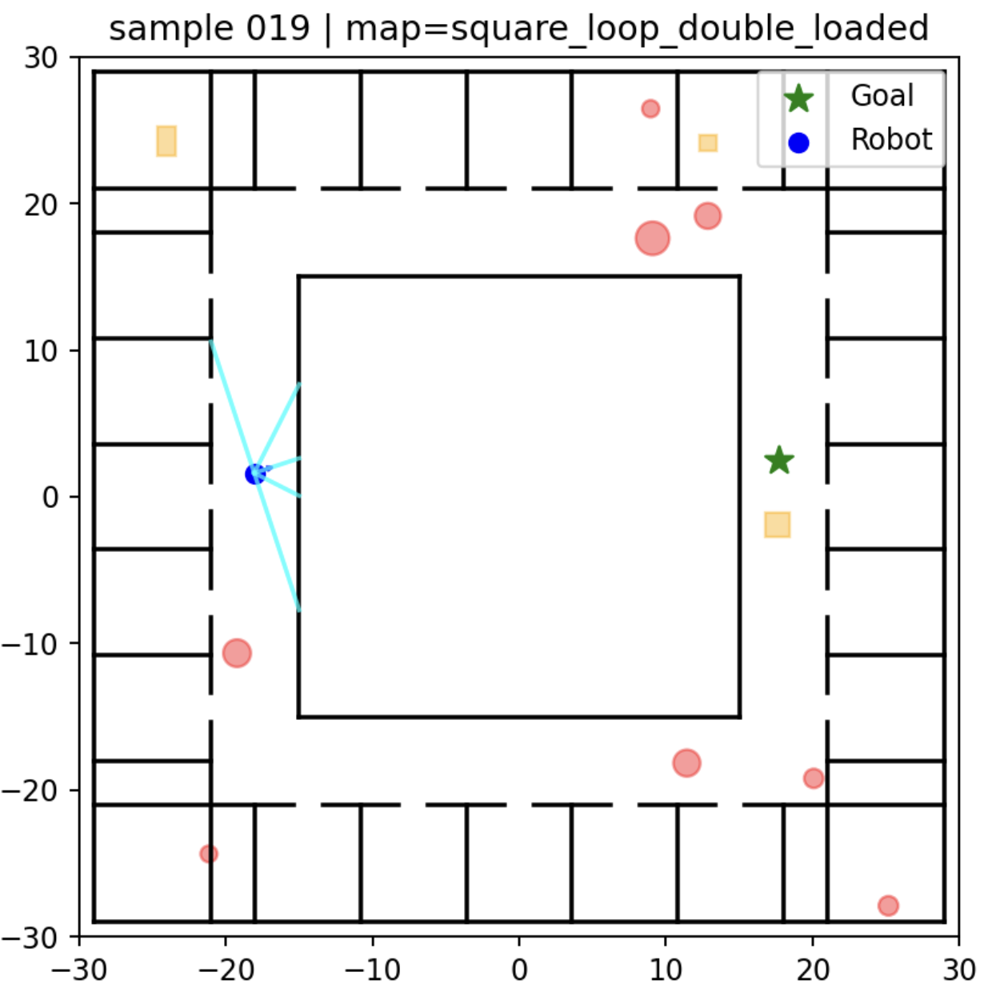
  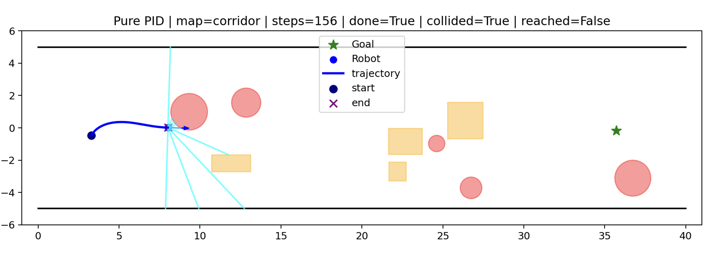
</p>

### CNN driver fatigue detection (capstone)

<p align="center">
  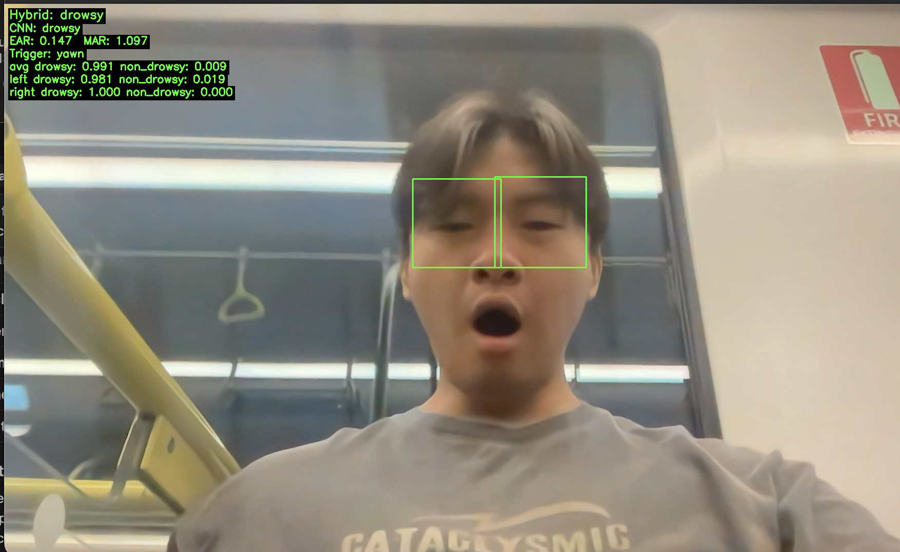
  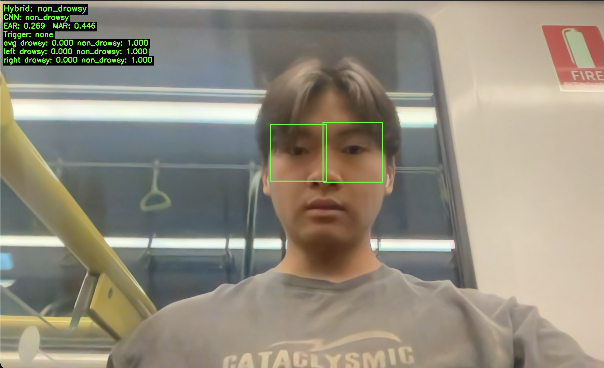
</p>

### DAPPA (career)

<p align="center">
  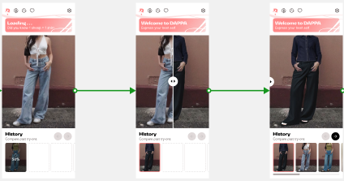
  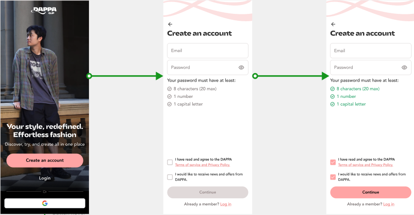
  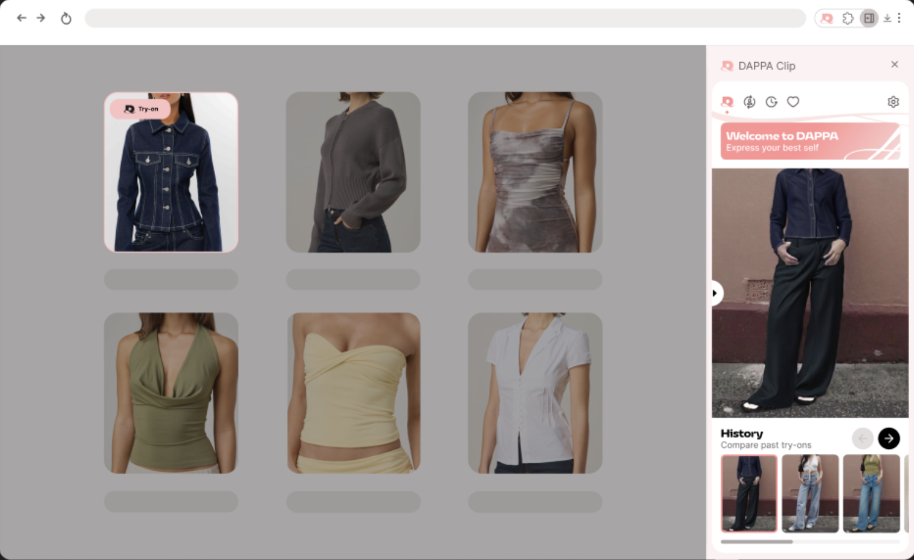
</p>

> **Note:** Image paths use `./public/...` from the repo root so they render on GitHub. Locally, the same files are served from `/images/...` in the Vite app.

## Development

```bash
npm install
npm run dev
```

```bash
npm run build
npm run preview
```
